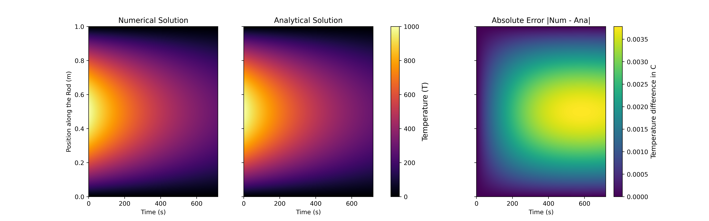

# computational-heat

This project explores mathematical modelling and numerical simulation through the study of the heat equation, starting from the idealized 1D rod with Dirichlet boundary conditions and working through the constraints of physical parameters. The analytical solution is derived via separation of variables and Fourier series expansion, while numerical approximations are computed using the Forward-Time Central-Space (FTCS) finite differences method.

## Features
- First-principles derivation of the 1D heat equation from Fourier's law and energy conservation
- Exact analytical solution using separation of variables
- Fourier coefficient derivation for arbitrary initial temperature profiles
- Finite difference discretization grid implementation
- Forward-Time Central-Space (FTCS) numerical solver
- Von Neumann Stability analysis and mathematical proof of the $r \leq 1/2$ stability criteria 

## Table of Contents
- [1. 1D Heat equation](#1d-heat-equation)
  - [1.1 Deriving the equation from first principles](#deriving-the-equation-from-first-principles)
  - [1.2 Analytical solution](#analytical-solution)
- [2. Numerical solution](#numerical-solution)
  - [2.1 Finite differences](#finite-differences)
  - [2.2 Forward-Time Central-space](#forward-time-central-space)
  - [2.3 Implementation](#implementation)
  - [2.4 Results](#results)
- [3. Future work](#3-future-work)

## 1D Heat equation 

We consider a homogeneous 1D rod of size $[0, L]$, with no internal heat generation and constant physical parameters.      

We further assume that the temperature at the extremities of the rod is null: $T(0,t) = T(L,t) = 0$      
And that the temperature field at t = 0 can be expressed as $T(x,0) = f(x)$     

### Deriving the equation from first principles 

Fourier's law tells us:   

$$
q(x,t) = - k \frac{\partial T}{\partial x}
$$

Where $T(x,t)$ is the temperature field, and _k_ is a constant due to the assumption of homogeneity.   

And conservation of Energy tells us:   

$\frac{d}{dt}(Internal \ energy)$ = (heat flux in) - (heat flux out) + (internal generation)   
   
In our case, since a slice of the rod is $[x, x + \Delta x]$ , we can derive the Internal energy as:   

$$
E = \rho cA\Delta x T(x,t)
$$

Where:   

$$
\begin{cases}
\rho \text{ is the density} \\
c \text{ is the specific heat capacity} \\
A\Delta x \text{ is the volume of the slice} \\
T \text{ is the temperature}
\end{cases}
$$

Considering $\rho$, c and A as constants, $\frac{\partial E}{\partial t}$ can thus be expressed as:   

$$
\frac{\partial E}{\partial t} = \frac{d(\rho cA\Delta x T(x,t))}{dt} = \rho cA\Delta x \frac{\partial T}{\partial t}
$$

i.e.,

$$
\rho cA\Delta x \frac{\partial T}{\partial t} = Aq(x,t) - Aq(x + \Delta x, \ t)
$$

Dividing both sides by $A \Delta x$ yields:   

$$
\rho c\frac{\partial T}{\partial t} = \frac{q(x,t) - q(x + \Delta x, \ t)}{\Delta x}
$$

Setting $\Delta x \to 0$ yields the derivative:   

$$
\lim_{\Delta x \to 0}  \frac{q(x,t) - q(x + \Delta x, \ t)}{\Delta x} = -\frac{\partial q}{\partial x}
$$

i.e.,   

$$
\frac{\partial q}{\partial x} = -\rho c\frac{\partial T}{\partial t}
$$

Differentiating Fourier's law with respect to x lands us:   

$$
\frac{\partial q}{\partial x} = -k \frac{\partial^2 T}{\partial x^2 }
$$

Substituting the formula right above yields:   

$$
\rho c \frac{\partial T}{\partial t} = k \frac{\partial^2 T}{\partial x^2 }
$$

i.e.,   

$$
\begin{cases}
\frac{\partial T}{\partial t} = \alpha \frac{\partial^2 T}{\partial x^2 } \\
\alpha = \frac {k}{\rho c}
\end{cases}
$$

Which is exactly the 1-D heat equation.   

### Analytical solution 

We now consider the 1D heat equation:   

$$
\frac{\partial T}{\partial t} = \alpha \frac{\partial^2 T}{\partial x^2 }
$$

With the conditions:   

$$
\begin{cases}
T(0,t) = T(L,t) = 0 \\
T(x,0) = f(x)
\end{cases}
$$

We first assume that the solution can be written as two separate functions:

$$
T(x,t) = X(x)H(t)
$$

Plugging this into the heat equation yields:

$$
X(x)H'(t) = \alpha X''(x)H(t)
$$

Dividing both sides by $X(x)H(t)$ gives:

$$
\frac{H'(t)}{H(t)} = \alpha \frac{X''(x)}{X(x)}
$$

For these two functions of x and t to be equal for all (x,t), they must both be equal to the same constant $-\lambda$

i.e.,

$$
\begin{cases}
\frac{1}{\alpha} \frac{H'(t)}{H(t)} = -\lambda \\
\frac{X''(x)}{X(x)} = -\lambda
\end{cases}
$$

The first equation is a homogeneous ODE, and its solution is:

$$
H(t) = C_t e^{-\lambda \alpha t }
$$

The second one is a homogeneous second order ODE:

$$
X''(x) + \lambda X(x) = 0
$$

Solving it requires solving the characteristic equation:

$$
r^2 + \lambda = 0
$$

If $\lambda = 0$ , the solution is:

$$
\begin{cases}
X(x) = Ax + B \\
(A,B) \in \mathbf{R} 
\end{cases}
$$

Since $X(0) = 0$ and $X(L) = 0$ :

$$
X(x) = 0
$$ 

Which is a trivial solution.   

If $\lambda < 0$ : $r = \pm \sqrt{-\lambda}$, the solution is:   

$$
\begin{cases}
X(x) = Ae^{\sqrt{{-\lambda}} x} + Be^{-\sqrt{-\lambda} x} \\
X(0) = 0 \\
X(L) = 0 
\end{cases}
$$

Solving $X(0) = 0$ yields $B = -A$

i.e., 

$$
X(x) = A(e^{\sqrt{{-\lambda}} x} - e^{-\sqrt{{-\lambda}} x})
$$

Plugging in $X(L) = 0$ yields:

$$
A(e^{ \sqrt{-\lambda} L } - e^{-\sqrt{-\lambda} L}) = 0
$$

i.e.,

$$
\begin{cases}
A = 0 \\
X(x) = 0 \\
\end{cases}
$$

Which is again trivial.

If $\lambda > 0$ : $r = \pm i\sqrt{\lambda}$, the solution is therefore:

$$
X(x) = A \cos{\sqrt{\lambda} x} + B \sin{\sqrt{\lambda} x}
$$

Plugging in the initial condition $X(0) = 0$ : 

$$
A = 0
$$

i.e.,

$$
X(x) = B \sin{\sqrt{\lambda} x}
$$

As for the second condition : 

$$
B \sin{\sqrt{\lambda} L } = 0
$$

$B = 0$ yields us again with a trivial solution. Let $B \neq 0$ :

$$
\sin{\sqrt{\lambda} L } = 0
$$

$\Rightarrow$

$$
\begin{cases}
\sqrt{\lambda} L = \pi n \\
n \in \mathbf{N}
\end{cases}
$$

$\Rightarrow$

$$
\lambda_{n} = (\frac{\pi n}{L})^2
$$

i.e.,

$$
\begin{cases}
X_n(x) = b_n \sin(\frac{\pi nx}{L}) \\
B = b_n \text{ for each } X_n
\end{cases}
$$

Finally we have that:

$$
T_n(x,t) = X_n(x)H_n(t) = C_t b_n \sin(\frac{\pi nx}{L}) e^{-(\frac{\pi n}{L})^2 \alpha t } 
$$

Let $C_t b_n = C_n$

$$
T_n(x,t) = C_n \sin(\frac{\pi nx}{L}) e^{-(\frac{\pi n}{L})^2 \alpha t } 
$$

Since the heat equation is linear, a sum of its solutions is also a solution, we can generalise by taking the sum of all the solutions we've found:

$$
T(x,t) = \sum_{n=1}^{\infty} C_n \sin(\frac{\pi nx}{L}) e^{-(\frac{\pi n}{L})^2 \alpha t } 
$$

Plugging in the initial condition $T(x,0) = f(x)$ yields:

$$
f(x) = \sum_{n=1}^{\infty} C_n \sin(\frac{\pi nx}{L})
$$

Which is a Fourier Series, we must derive its coefficient to get the general solution.  

Let $(m,n) \in \mathbf{N^2}$ : 

$$
f(x) = \sum_{n=1}^{\infty} C_n \sin(\frac{\pi nx}{L})
$$

$\Rightarrow$

$$
\sin(\frac{\pi mx}{L}) f(x) = \sin(\frac{\pi mx}{L}) \sum_{n=1}^{\infty} C_n \sin(\frac{\pi nx}{L})
$$

$\Rightarrow$

$$
\int_{0}^{L} \sin(\frac{\pi mx}{L}) f(x) = \int_{0}^{L} \sin(\frac{\pi mx}{L}) \sum_{n=1}^{\infty} C_n \sin(\frac{\pi nx}{L})
$$

$\Rightarrow$

$$
\int_{0}^{L} \sin(\frac{\pi mx}{L}) f(x) dx = \sum_{n=1}^{\infty} \int_{0}^{L} C_n\sin(\frac{\pi mx}{L}) \sin(\frac{\pi nx}{L}) dx
$$

i.e.,

$$
\int_{0}^{L} \sin(\frac{\pi mx}{L}) f(x) dx = C_m \frac{L}{2}
$$

This is because : 

$$
\int_{0}^{L} \sin\left(\frac{m\pi x}{L}\right) \sin\left(\frac{n\pi x}{L}\right)\,dx =
\begin{cases}
0 & m \ne n \\
\frac{L}{2} & m = n
\end{cases}
$$

the Fourier coefficient of f can therefore be expressed as:   

$$
C_n = \frac{2}{L} \int_{0}^{L} \sin(\frac{\pi nx}{L}) f(x) dx 
$$

The general solution to the heat equation under our boundary conditions is therefore:

$$
T(x,t) = \sum_{n=1}^{\infty} \left ( \frac{2}{L}  \int_{0}^{L}  \sin(\frac{\pi nz}{L}) f(z) dz \right)\ \sin(\frac{\pi nx}{L}) e^{-(\frac{\pi n}{L})^2 \alpha t } 
$$

Now that we have the analytical solution, it will serve as a benchmark for validating our numerical solutions.

## Numerical solution

As stated previously, the one-dimensional heat equation is:

$$
\frac{\partial T}{\partial t} = \alpha \frac{\partial^2 T}{\partial x^2 }
$$

Our initial and boundary conditions are:

$$
\begin{cases}
T(0,t) = T(L,t) = 0 \\
T(x,0) = f(x)
\end{cases}
$$

The solution $T : [0,L] \times \mathbf{R^+} \to \mathbf{R}$ is a continuous function on $[0,L] \times \mathbf{R^+}$ .

Since it is impossible to calculate the solution at infinitely many points, we first discretize both time and space as such:

$$
\begin{cases}
x_j = j \Delta x \text{ with } j \in \{0, \ldots, N\} \\
\Delta x = \frac{L}{N} \\
\end{cases}
\text{ Where N is the number of spatial intervals}
$$

Similarly, the time grid is defined as such:

$$
\begin{cases}
t^n = n \Delta t \text{ with } n \in \mathbf{N}\\
\Delta t \text{ is the time step}
\end{cases}
$$

The numerical approximation will be denoted as $T_{j}^{n} =T(x_j,t^n)$

### Finite differences

The first-order Taylor expansion of a sufficiently smooth function _f_ is:

$$
f(x+h) = f(x) + hf'(x) + O(h^2) 
$$

i.e.,

$$
f'(x) = \frac{f(x + h) - f(x)}{h} + O(h) 
$$

Finite differences use the simple idea that neglecting the $O(h)$ term gives us an approximation of $f'(x)$:

$$
f'(x) \approx \frac{f(x + h) - f(x)}{h} 
$$

This approximation is called the forward difference approximation since it uses "$f(x+h) - f(x)$", it is first-order accurate due to the truncation of the $O(h)$ term.   

Similarly, we can obtain an approximation for the second derivative of f using its fourth-order Taylor expansion:

$$
\begin{cases}
f(x+h) = f(x) + hf'(x) + \frac{h^2}{2} f''(x) + \frac{h^3}{6} f'''(x) + O(h^4) \\
f(x-h) = f(x) - hf'(x) + \frac{h^2}{2} f''(x) - \frac{h^3}{6} f'''(x) + O(h^4)
\end{cases}
$$

Adding these two equations yields:

$$
f(x+h) + f(x-h) =  2 f(x) + h^2 f''(x) + O(h^4)
$$

Solving for $f''(x)$:

$$
f''(x) = \frac{f(x+h) - 2 f(x) + f(x-h)}{h^2} + O(h^2)
$$

Discarding the $O(h^2)$ term yields:

$$
f''(x) \approx \frac{f(x+h) - 2 f(x) + f(x-h)}{h^2}
$$

This is the central difference approximation; it is second-order accurate due to the truncation of the $O(h^2)$ term.

### Forward-Time Central-Space

Using the forward approximation on the time derivative yields:

$$
\frac{\partial T}{\partial t} \approx \frac{T_{j}^{n+1} - T_{j}^{n}}{\Delta t}
$$

Likewise, using the central difference approximation to compute the second-order space derivative yields:

$$
\frac{\partial^2 T}{\partial x^2 } \approx \frac{T_{j+1}^{n} - 2 T_{j}^{n} + T_{j-1}^{n}}{(\Delta x )^2}
$$

Plugging this into the heat equation:

$$
\frac{T_{j}^{n+1} - T_{j}^{n}}{\Delta t} = \alpha \frac{T_{j+1}^{n} - 2 T_{j}^{n} + T_{j-1}^{n}}{(\Delta x )^2}
$$

Solving for $T_{j}^{n+1}$:

$$
T_{j}^{n+1} = \frac{\alpha \Delta t}{(\Delta x )^2}(T_{j+1}^{n} - 2 T_{j}^{n} + T_{j-1}^{n}) + T_{j}^{n}
$$

Let $r = \frac{\alpha \Delta t}{(\Delta x )^2}$:

$$
T_{j}^{n+1} = r(T_{j+1}^{n} - 2 T_{j}^{n} + T_{j-1}^{n}) + T_{j}^{n}
$$

Rearranging yields:

$$
T_{j}^{n+1} = (1 - 2r) T_{j}^{n} + r(T_{j+1}^{n} + T_{j-1}^{n}) 
$$

Which is the FTCS approximation (Forward time, central space).

It is interesting to note that this solution is only conditionally stable: Under certain conditions, the error could grow exponentially.

To properly account for this, we model the error as a Fourier mode:

$$
\epsilon_j^n = \xi^n e^{ik j\Delta x}
$$

Where $\xi$ is the amplification factor and $k$ is the wave number. Stability requires that the error does not grow over time, i.e.:

$$
|\xi| \leq 1
$$

This works because since the error vanishes at the boundaries (just like T does), it satisfies the same conditions that made the sine series a valid basis for the solution in the analytical resolution, the error can therefore be decomposed into that same Fourier basis.

Plugging the error into the FTCS scheme:

$$
\epsilon_{j}^{n+1} = (1 - 2r) \epsilon_{j}^{n} + r(\epsilon_{j+1}^{n} + \epsilon_{j-1}^{n}) 
$$

i.e.,

$$
\xi^{n+1} e^{ik j\Delta x} = (1 - 2r) \xi^n e^{ik j\Delta x} + r(\xi^n e^{ik (j+1)\Delta x} + \xi^n e^{ik (j-1)\Delta x}) 
$$

Dividing both sides by $\xi^{n} e^{ik j\Delta x}$ yields:

$$
\xi = 1 - 2r +r(e^{ik \Delta x} + e^{-ik \Delta x})
$$

i.e.,

$$
\xi = 1 - 2r + 2r \cos(k \Delta x)
$$

$\Rightarrow$

$$
\xi = 1 - 2r(1 - \cos(k \Delta x))
$$

Knowing that $1 - \cos(\theta) = 2 \sin^2 (\frac{\theta}{2})$:

$$
\xi = 1 - 4r\sin^2(\frac{k \Delta x}{2})
$$

We need $|\xi| \leq 1$ i.e.,

$$
-1 \leq 1 - 4r\sin^2(\frac{k \Delta x}{2}) \leq 1
$$

The right side is always verified since $r > 0$, the left one is:

$$
-1 \leq 1 - 4r\sin^2(\frac{k \Delta x}{2})
$$

i.e.,

$$
4r\sin^2(\frac{k \Delta x}{2}) \leq 2
$$

The inequality must be true for all possible $k$, the worst case is $\sin^2(\frac{k \Delta x}{2}) = 1$:

$$
4r \leq 2
$$

i.e,

$$
r \leq \frac{1}{2}
$$

Which finally gives us the stability condition:

$$
\frac{\alpha \Delta t}{(\Delta x )^2} \leq \frac{1}{2}
$$

i.e.,

$$
\Delta t \leq \frac{(\Delta x )^2}{2 \alpha}
$$

Violating this condition leads to the error growing exponentially, and making the simulation useless.

Since this is true for all Fourier modes, it must be true of any error which can be represented by a Fourier series, which in our case is all of them.

### Implementation

To correctly apply the FTCS approximation, we must first model our system as a space time matrix:

$$
\begin{pmatrix}
T_{0}^{0} & T_{0}^{1} & .. & .. & T_{0}^{N} \\
T_{1}^{0} & .. &.. & .. & T_{1}^{N} \\
.. & .. & .. & .. & .. \\
.. & .. & .. & .. & .. \\
T_{I}^{0} & T_{I}^{1} & .. & .. & T_{I}^{N}
\end{pmatrix}
$$

Which with our boundary conditions translates to:

$$
\begin{pmatrix}
0 & 0 & .. & .. & 0 \\
T_{1}^{0} & .. &.. & .. & T_{1}^{N} \\
.. & .. & .. & .. & .. \\
.. & .. & .. & .. & .. \\
0 & 0 & .. & .. & 0
\end{pmatrix}
$$

The current state is represented by a state vector:

$$
T^n = 
\begin{pmatrix}
T_{0}^{n} \\
T_{1}^{n} \\
.. \\
.. \\
T_{I}^{n} 
\end{pmatrix}
$$

The update loop for internal points (Since the edges are always at 0 there's no need to compute them) can therefore be written as:

$$
T_{int}^n = 
\begin{pmatrix}
T_{1}^{n} \\
T_{2}^{n} \\
.. \\
.. \\
T_{I-1}^{n} 
\end{pmatrix}
$$

$$
T_{int}^{n+1} =  (1 - 2r) T_{int}^{n} + r(T_{left}^{n} + T_{right}^{n})
$$

With:

$$
T_{left}^n = 
\begin{pmatrix}
T_{0}^{n} \\
T_{1}^{n} \\
.. \\
.. \\
T_{I-2}^{n} 
\end{pmatrix}
\text{ and }
T_{right}^n = 
\begin{pmatrix}
T_{2}^{n} \\
T_{3}^{n} \\
.. \\
.. \\
T_{I}^{n} 
\end{pmatrix}
$$

This implementation, as well as the comparison between the analytical and numerical solutions can be found in "models/one_dimensional.py"

### Results

This graph shows a comparison between two heatmaps generated with both the Analytical and numerical solutions of the heat equation. As well as a heatmap of the error.

## 3. Future Work

- Implementation of the analytical solution and comparison with the FTCS method.
- Implementing a Gaussian as the initial heat grid.
- Solving the 2D heat equation

